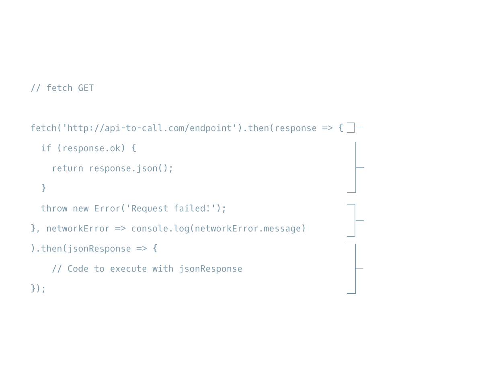

Lesson link:

https://www.codecademy.com/courses/learn-intermediate-javascript/lessons/js-requests-with-fetch-api/exercises/intro-to-fetch-get-requests

### REQUESTS WITH FETCH API

## Intro to GET Requests using Fetch

The first type of requests we’re going to tackle is GET requests using fetch().

The fetch() function:

- Creates a request object that contains relevant information that an API needs.
- Sends that request object to the API endpoint provided.
- Returns a promise that ultimately resolves to a response object, which contains the status of the promise with information the API sent back.

Let’s walk through the boilerplate code to the right **(actually at the botton of this page)** for using fetch() to create a GET request step by step.

First, call the fetch() function and pass it a URL as a string for the first argument, determining the endpoint of the request.

```
fetch('https://api-to-call.com/endpoint')

```
The.then() method is chained at the end of the fetch() function and in its first argument, the response of the GET request is passed to the callback arrow function. The .then() method will fire only after the promise status of fetch() has been resolved.

Inside the callback function, the ok property of the response object returns a Boolean value. If there are no errors, response.ok will be true and the code will return response.json().

If response.ok is a falsy value, our code will throw an error.
```
throw new Error('Request failed!');
```
A second argument passed to .then() will be another arrow function that will be triggered when the promise is rejected. It takes a single parameter, networkError. This object logs the networkError if we could not reach the endpoint at all (e.g., the server is down).

A second .then() method will run after the previous .then() method has finished running without error. It takes jsonResponse, which contains the returned response.json() object from the previous .then() method, as its parameter and can now be handled, however we may choose.

### Instructions

In the next exercise, we will apply what we have learned to making a GET request using fetch() and .then(). Move on to the next exercise when you’re ready!


