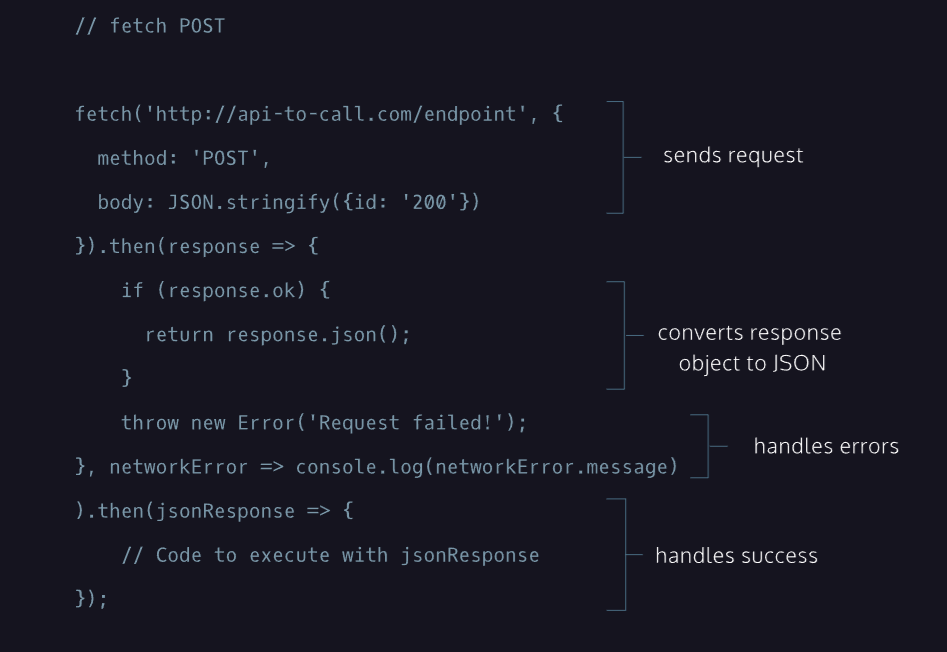

lesson link:

https://www.codecademy.com/courses/learn-intermediate-javascript/lessons/js-requests-with-fetch-api/exercises/intro-to-fetch-post-requests

#### REQUESTS WITH FETCH API

### Intro to POST Requests using Fetch

In the previous exercise, we successfully wrote a GET request using the fetch API and handled Promises to get word suggestions from Datamuse. Give yourself a pat on the back (or two to treat yourself)!

Now, we’re going to learn how to use fetch() to construct POST requests!

Take a look at the diagram to the right **(at the bottom of this page)**. It has the boilerplate code for a POST request using fetch().

Notice that the fetch() call takes two arguments: an endpoint and an object that contains information needed for the POST request.

The object passed to the fetch() function as its second argument contains two properties: method, with a value of 'POST', and body, with a value of JSON.stringify({id: '200'});. This second argument determines that this request is a POST request and what information will be sent to the API.

A successful POST request will return a response body, which will vary depending on how the API is set up.

The rest of the request is identical to the GET request. A .then() method is chained to the fetch() function to check and return the response as well as throw an exception when a network error is encountered. A second .then() method is added on so that we can use the response however we may choose.

